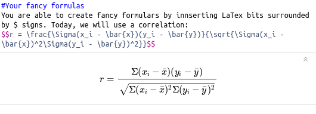

```{r setup, include=FALSE}
knitr::opts_chunk$set(echo = FALSE)
```

## Introduction
- R is an open source programming language for statistics and data visualisation.
- Markdown is a lightweight markup language.

##RMarkdown workflow
.


## Pros 
* Reproducibility: RMarkdown can be used to make scientific analysis more reproducible. 
* Track and avoid mistakes:
      * Rounding p-value,
      * Copy & paste,
      * Forgetting to up update statistic.
* Easy to share code of analysis with journals or public.

## Contra
* Sometimes things go wrong when you try to knit a document to .html file, when it was written to be knit a .pdf file (see workflow). 
* You will frequently need to ask for help for more intricate stuff for instance on [https://stackoverflow.com](https://stackoverflow.com).
* List of references are generated at the end of the script. Some journal want to have the figures etc. at the end. 

##YAML
.

## R Chunks
.

##Analysis
.

##Graphics
.

##Graphics
.

##Tables
.

##Tables
.

##Reporting statistics
.
.

##Formulas
.

##Citation 
.

##Citation
.

##Citation
.


## Thank you
- If you need help, send me an e-mail Alex.Quent at mrc-cbu.cam.ac.uk.
- Scripts, presentation etc. available on [https://github.com/JAQuent/methodsDay2017](https://github.com/JAQuent/methodsDay2017).

# Questions?
