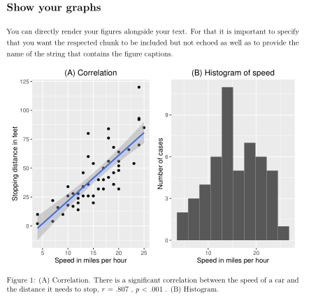

```{r setup, include=FALSE}
knitr::opts_chunk$set(echo = FALSE)
```

## Introduction
- R is an open source programming language for statistics and data visualisation.
- Markdown is a lightweight markup language.

##RMarkdown workflow


##Pros 
* Easy to share whole code used for analysis with the public and journals.
* Helps to achieve higher reproducibility with respect to analysis.
* Many manuscripts contain erroneous statistics (see statcheck; Nuijten et al., 2016).
* RMarkdown helps to track and avoid mistakes:
      * Rounding _p_-value,
      * Copy & paste errors,
      * Forgetting to up update statistic.

##Cons
* Sometimes things might go wrong when you try to switch between output formats (e.g. from .pdf to .html) 
* You will frequently find yourself that you need to ask for help for more intricate stuff for instance on [https://stackoverflow.com](https://stackoverflow.com).
* List of references can only be generated at the end of the script. 

##YAML header
.

## R Chunks
.

##Analysis
.

##Reporting statistics
.
.

##Graphics
.

##Graphics
.

##Tables
.

##Tables
.

##Formulas
.

##Citation 
.

##Citation
.

##Citation
.


## Thank you
- If you need help, send me an e-mail Alex.Quent at mrc-cbu.cam.ac.uk.
- Scripts, presentation etc. available on [https://github.com/JAQuent/methodsDay2017](https://github.com/JAQuent/methodsDay2017).

# Questions?
